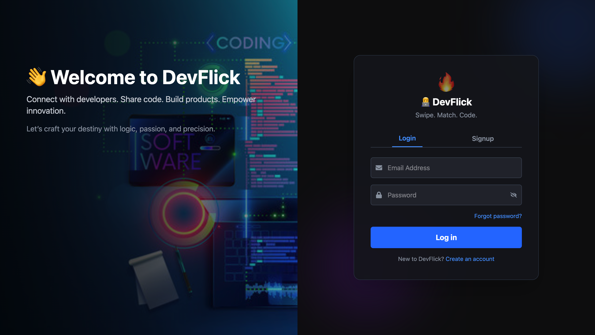
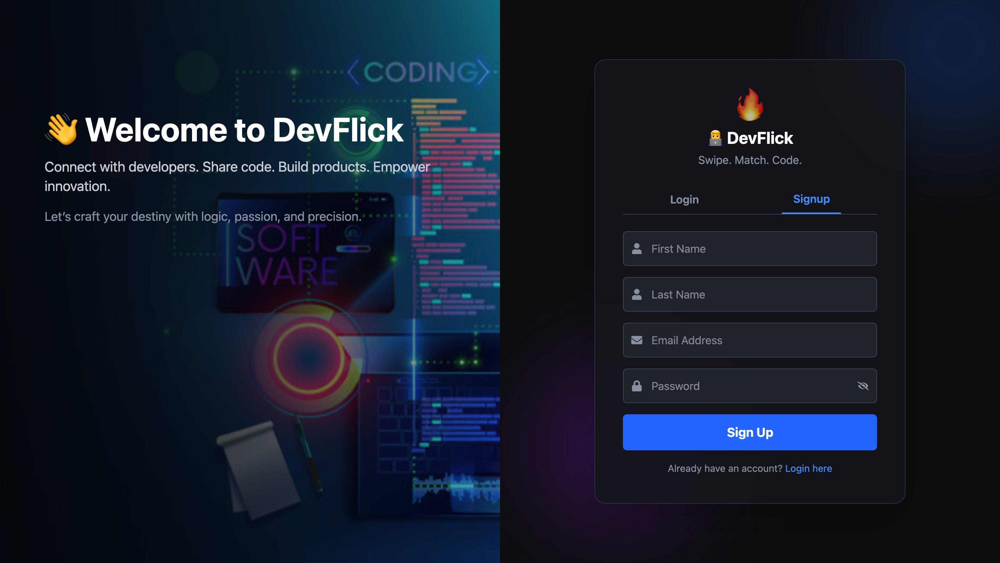
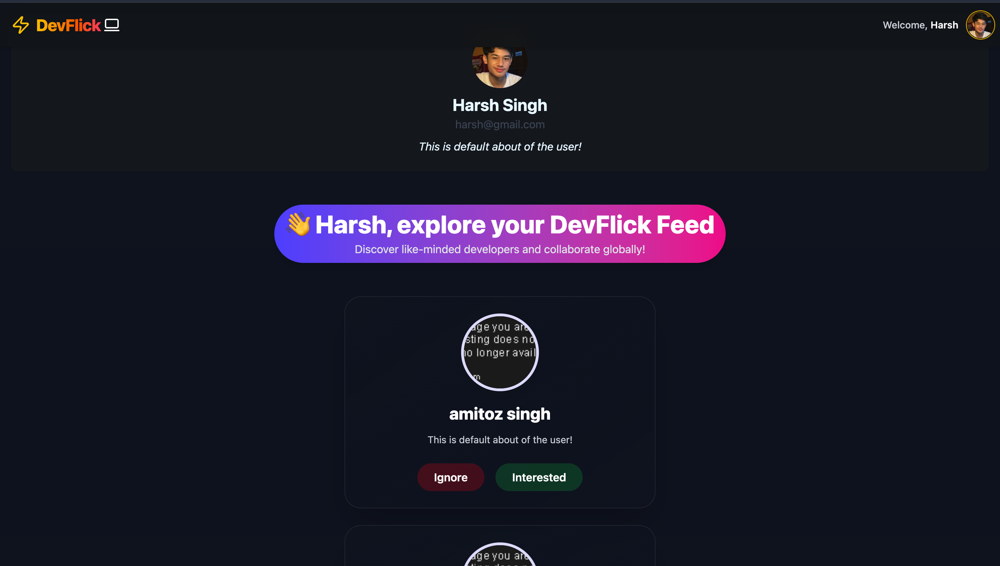
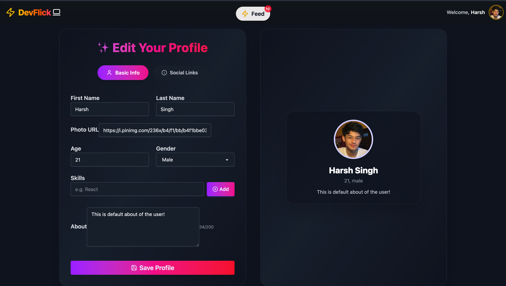
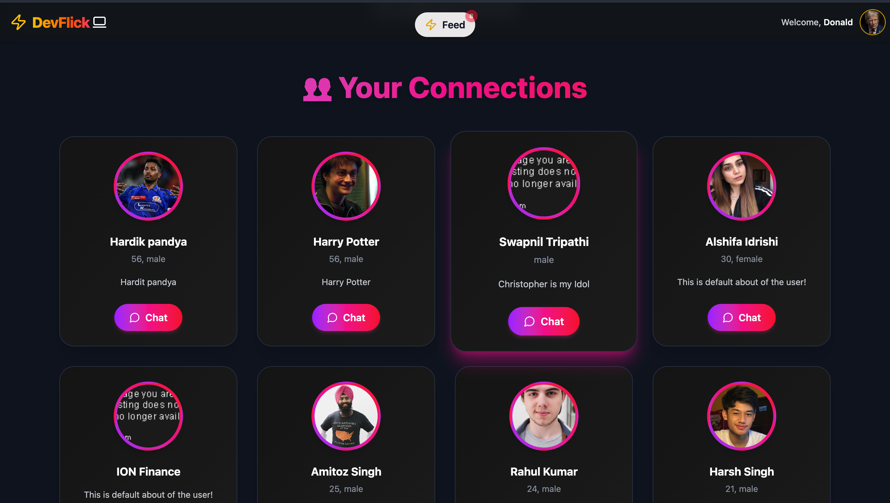
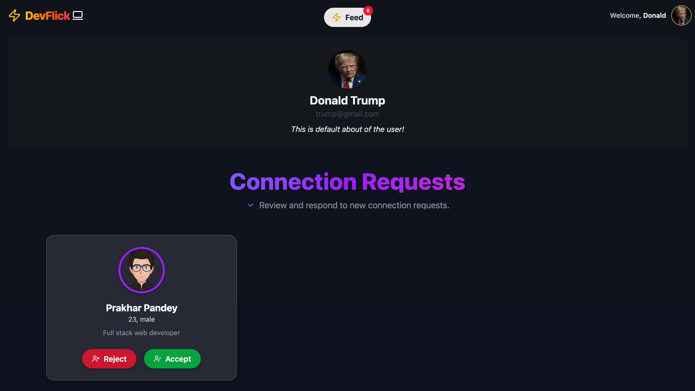

# 🚀 DevFlick – Connect with Developers Like Never Before!

## 🔥 Overview
**DevFlick** is a developer networking platform where tech enthusiasts can **connect, chat, and collaborate** based on mutual interests.  
Inspired by **Tinder**, users can swipe left to ignore or right to connect, with **real-time chat features powered by Socket.io**.

---

## 🚀 Live Demo
👉 [Click Here](https://dev-flick-web.vercel.app)

## 📌 GitHub Repositories
- [Backend Repository](https://github.com/Vikash7080/DevFlick-Backend)  
- [Frontend Repository](https://github.com/Vikash7080/DevFlick-web-Fronted)

---

## ✨ Features
- ✅ **JWT & Cookie-based Authentication** – Secure login & signup  
- ✅ **Swipeable Feed** – Browse developer profiles easily  
- ✅ **Connection Requests** – Accept/reject requests  
- ✅ **Real-time Chat** – Powered by Socket.io  
- 💬 **Typing Indicator** – WhatsApp-style typing status  
- ✅ **Profile Management** – Edit & update your details  
- 💳 **Premium Membership** – Razorpay payment integration  

---

## 🛠 Tech Stack
- **Frontend:** React.js, JavaScript, Tailwind CSS, DaisyUI  
- **Backend:** Node.js, Express.js, MongoDB, Socket.io  
- **Authentication:** JWT & Cookies  
- **Payments:** Razorpay  

---
## 📸 Screenshots

### 1. Home/Login Page

### 2. SignUp Page

### 3.Feed Page

### 4.Profile/Edit Profile Page

### 5.Connections Page

### 6.Requests Page

### 7.Payment Page

### 8.Verified/Premium  Page

### 9.Chat Page

## 🧠 Upcoming Features
- 🚧 Online/Offline Status (last seen, active now)  
- 📎 File Attachments in Chat (images, PDFs, code snippets)  
- 🎨 UI/UX Enhancements for better experience  
- 🎯 Daily Match Suggestions (based on interests/languages)  
- 📊 Activity Stats (profile views, swipes, connections)  
- 🛡️ Reporting & Blocking  
- 🔔 Push Notifications (browser & mobile)  
- 📱 PWA & Mobile Responsiveness  
- 💥 Unit & Integration Testing  

---

## 📫 Contact
👨‍💻 **Author:** Vikash Sengar  
📧 **Email:** [sengarvikash256@gmail.com](mailto:sengarvikash256@gmail.com)  
🔗 **GitHub:** [Vikash7080](https://github.com/Vikash7080)  

## 🧠 Upcoming Features
- 🚧 Online/Offline Status (last seen, active now)  
- 📎 File Attachments in Chat (images, PDFs, code snippets)  
- 🎨 UI/UX Enhancements for better experience  
- 🎯 Daily Match Suggestions (based on interests/languages)  
- 📊 Activity Stats (profile views, swipes, connections)  
- 🛡️ Reporting & Blocking  
- 🔔 Push Notifications (browser & mobile)  
- 📱 PWA & Mobile Responsiveness  
- 💥 Unit & Integration Testing  

---

## 📫 Contact
👨‍💻 **Author:** Vikash Sengar  
📧 **Email:** [sengarvikash256@gmail.com](mailto:sengarvikash256@gmail.com)  
🔗 **GitHub:** [Vikash7080](https://github.com/Vikash7080)  
